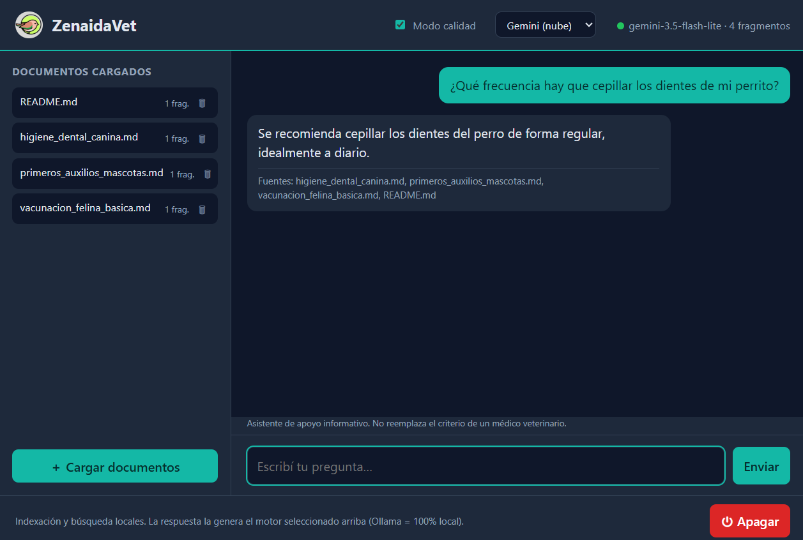
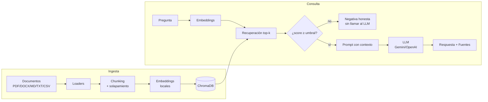

# 🕊️ ZenaidaRAG

**Asistente RAG de apoyo veterinario** — responde preguntas sobre un corpus de
documentos con **recuperación semántica**, **citación de fuentes** y **negativa
honesta** (no alucina: si el contexto no cubre la pregunta, lo dice).

**Indexación y recuperación 100% locales** (ChromaDB + embeddings locales, $0):
tus documentos se procesan y buscan en tu máquina, no salen a la nube. El LLM
que **redacta** la respuesta es intercambiable: Gemini/OpenAI (nube) por defecto,
o **Ollama** para correr *también* la generación en local y ser 100% offline.
Diseñado bajo el principio **"clona y corre en 2 minutos"**.

> Con Gemini/OpenAI, al momento de responder se envían al proveedor **solo la
> pregunta y los fragmentos recuperados**. Con `LLM_PROVIDER=ollama` nada sale
> de tu equipo.

> 🩺 Herramienta educativa / de apoyo. **No** reemplaza el criterio de un médico
> veterinario.

[](https://github.com/Znaida/ZenaidaRAG/actions)
· Licencia MIT · Python ≥3.10 · 64 tests · ~80% cobertura del núcleo

---

## Estado

✅ **Completo** — fases 0 a 7 implementadas y probadas en local (ver
[`docs/ROADMAP.md`](docs/ROADMAP.md)).

- [x] **Fase 0 — Cimientos:** esqueleto de repo, CLI, config, CI, tests de humo.
- [x] **Fase 1 — Ingesta:** docs → chunks → embeddings locales → ChromaDB.
- [x] **Fase 2 — Recuperación + respuesta** con citación y negativa honesta (CLI `ask`).
- [x] **Fase 3 — API FastAPI** con streaming SSE (`POST /ask`, `GET /health`).
- [x] **Fase 4 (opcional) — Calidad:** búsqueda híbrida (BM25+RRF), reranking
  cross-encoder y set de evaluación (`zenaidarag eval`). Opcionales por config.
- [x] **Fase 5 (opcional) — Canales:** bot de Telegram (polling) + adaptador
  Teams/Bot Framework documentado.
- [x] **Fase 6 — Pulido:** Docker + Compose, CI (tests + build), diagrama, auditoría.
- [x] **Fase 7 — App de escritorio:** ventana nativa (pywebview) con chat, carga
  de documentos y citación de fuentes; lanzador de un click en Windows.

## Cómo correr

```bash
git clone https://github.com/Znaida/ZenaidaRAG
cd ZenaidaRAG
python -m venv .venv && . .venv/Scripts/activate   # Windows
pip install -e ".[dev]"

cp .env.example .env        # pegá tu GEMINI_API_KEY (o usá OpenAI)

zenaidarag ingest sample_docs                       # crea el índice vectorial
zenaidarag ask "¿Cada cuánto cepillo a mi perro?"   # responde citando fuentes
```

- Una pregunta **cubierta** por el corpus → respuesta fundamentada + `Fuentes:`.
- Una pregunta **fuera de dominio** → *"No tengo información suficiente…"* (no alucina).
- Sin gastar cuota: `LLM_PROVIDER=fake zenaidarag ask "..."` usa un LLM de prueba.

```bash
pytest        # 49 tests
```

### Modo 100% local, sin nube (Ollama)

Para que **también** la redacción de la respuesta sea local (sin API key ni
datos hacia afuera), usá [Ollama](https://ollama.com):

```bash
ollama pull llama3            # descarga un modelo local (una vez)
# en .env:  LLM_PROVIDER=ollama  y  LLM_MODEL=llama3
zenaidarag ask "¿Cada cuánto cepillo a mi perro?"
```

Los embeddings y el índice ya eran locales; con Ollama el LLM también, así que
**nada sale de tu máquina**. Por defecto Ollama escucha en `http://localhost:11434`
(configurable con `OLLAMA_HOST`).

## App de escritorio (ZenaidaVet)

Interfaz gráfica local: una ventana nativa con chat, carga de documentos y
citación de fuentes. Corre el backend RAG por dentro; todo en tu computadora.

**Windows — un solo click:**

> Doble clic en **`ZenaidaVet.bat`**. La primera vez prepara el entorno e
> ingiere los documentos de ejemplo; luego abre la app directamente. Solo
> necesitás tener [Python](https://www.python.org/downloads/) instalado y tu
> `GEMINI_API_KEY` en `.env`.

**Cualquier sistema — por comando:**

```bash
zenaidarag app        # abre la ventana + backend juntos
```

<p align="center">
  
</p>

<!-- Reemplazá assets/screenshot.png por una captura real de la app respondiendo
     una pregunta de veterinaria con sus fuentes citadas. -->

Controles en la interfaz (todos **en caliente**, sin reiniciar):

- **Cargar / eliminar documentos** con barra de progreso de ingesta.
- **Selector de LLM** (Gemini / OpenAI / Ollama): cambia el motor al instante; si
  el proveedor no está listo (falta API key, Ollama apagado) avisa y no rompe.
- **Modo calidad** (toggle): activa búsqueda híbrida (BM25) + reranking
  (cross-encoder) para corpus grandes. Apagado por defecto (respuestas ~1 s); al
  encenderlo, el reranker carga su modelo en segundo plano y avisa *"Reranking
  listo ✓"* cuando termina.
- **Precarga**: al abrir, un cartel indica que el modelo se está cargando y
  habilita el chat cuando está listo (evita que la primera pregunta se congele).

### Con Docker

```bash
cp .env.example .env               # pegá tu GEMINI_API_KEY
docker compose up --build          # levanta la API en :8000
docker compose run --rm zenaidarag ingest sample_docs   # ingesta inicial
```

> La imagen se construye automáticamente en **CI** (GitHub Actions). El modelo de
> embeddings (~470 MB) se descarga en el primer arranque y se cachea en un volumen.

### Como servicio (API)

```bash
zenaidarag serve                 # levanta FastAPI (por defecto en :8000)
# si el 8000 esta ocupado:  API_PORT=8500 zenaidarag serve
```

- `GET /health` → estado, nº de chunks indexados, proveedor/modelo LLM.
- `POST /ask` `{"question": "..."}` → respuesta **token a token (SSE)** + evento
  `sources` con las fuentes citadas. Docs interactivas en `/docs`.

```bash
curl -N -X POST http://127.0.0.1:8000/ask \
  -H "Content-Type: application/json" \
  -d '{"question":"¿Qué hago ante un golpe de calor en mi perro?"}'
```

## Arquitectura (resumen)



Interfaces desacopladas para intercambiar piezas:

| Interfaz | Rol | Por defecto |
|---|---|---|
| `Embeddings` | texto → vectores | sentence-transformers **multilingüe** local ($0) |
| `VectorStore` | indexar / recuperar chunks | ChromaDB local |
| `LLMProvider` | generar respuesta | Gemini (nube) por defecto; OpenAI, **Ollama** (local) o `fake` opc. |

El prompt obliga a **citar fuentes** y a responder *"no tengo información
suficiente"* cuando el contexto no alcanza (anti-alucinación, crítico en
dominio veterinario). Detalle y decisiones en [`docs/ROADMAP.md`](docs/ROADMAP.md)
y [`docs/adr/`](docs/adr/).

## Calidad de recuperación (opcional, Fase 4)

Dos mejoras **opcionales por config** (off por defecto para mantener el arranque
liviano y $0):

```bash
USE_HYBRID=true  zenaidarag ask "..."   # semántica + BM25 (keyword) vía RRF
USE_RERANK=true  zenaidarag ask "..."   # reordena con cross-encoder (descarga ~450 MB)
```

Set de evaluación reproducible (mide **hit@k, MRR y precisión de negativa**, sin
usar el LLM → no consume cuota):

```bash
zenaidarag eval
```

> **Nota honesta:** sobre `sample_docs/` (3 docs) el baseline ya alcanza
> **hit@k=100% / MRR=1.000** — el corpus es demasiado pequeño para mostrar mejora.
> Híbrido y reranking pagan en corpus grandes y ruidosos (p. ej. un manual
> veterinario completo). El framework de evaluación queda listo para medirlo.

## Canales (opcional, Fase 5)

El mismo motor RAG (con citación y negativa honesta) expuesto en otros canales:

```bash
# Telegram: crea un bot con @BotFather, pega el token en TELEGRAM_BOT_TOKEN y:
zenaidarag telegram
```

- **Telegram** (`channels/telegram.py`): bot por long-polling, cliente fino sobre
  la Bot API. Responde citando fuentes o con la negativa honesta.
- **Teams / Bot Framework** (`channels/teams_adapter.py`): adaptador por webhook
  **documentado** (traduce `Activity` → RAG → `Activity`); la lógica está lista,
  el despliegue en Azure Bot queda documentado, no requerido.

## Datos y copyright

- El repo incluye [`sample_docs/`](sample_docs/) de **licencia abierta**.
- Tus documentos reales van en `data/docs/` (**gitignored**).
- Los libros de veterinaria con copyright se usan **solo en local** (demo/video)
  y nunca se commitean (ADR-009).

## Licencia

MIT © Rudbel F. Ordaz. Ver [`LICENSE`](LICENSE).
